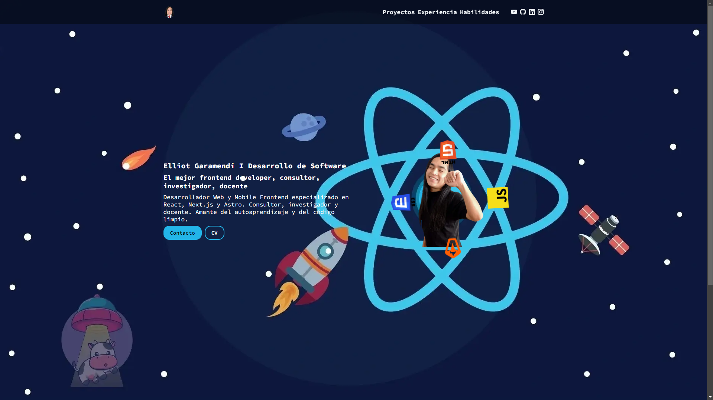

# [Portfolio EG](https://github.com/elliotgaramendi/portfolio-eg)

## 📜 Descripción 📜
Desarrollador Web y Mobile Frontend especializado en React, Next.js, Astro y React Native. Consultor dedicado al usuario. Investigador enfocado en la innovación. Docente comprometido con el crecimiento integral de los alumnos. Amante del autoaprendizaje y del código de calidad.

## 💻 Instalación 💻
- Ubicarse en la carpeta que contendrá el proyecto
- Abrir terminal de comandos
  - git clone https://github.com/elliotgaramendi/portfolio-eg.git
  - cd portfolio-eg
  - Abrir el proyecto con un servidor en un cliente

## 📚 Tecnologías principales 📚
| Tecnología      | Versión | Descripción                      |
| --------------- | ------- | -------------------------------- |
| HTML            | 5       | Lenguaje de Marcas de Hipertexto |
| CSS             | 3       | Hojas de Estilo en Cascada       |
| Bootstrap Icons | 1.11.3  | Conjunto de íconos vectoriales   |

## 🤗 Redes sociales 🤗
- 🐭 YouTube: https://www.youtube.com/@elliotgaramendi 🐭
- 🐭 GitHub: https://github.com/elliotgaramendi 🐭
- 🐭 LinkedIn: https://www.linkedin.com/in/elliotgaramendi/ 🐭
- 🐭 Instagram: https://www.instagram.com/elliotgaramendi/ 🐭